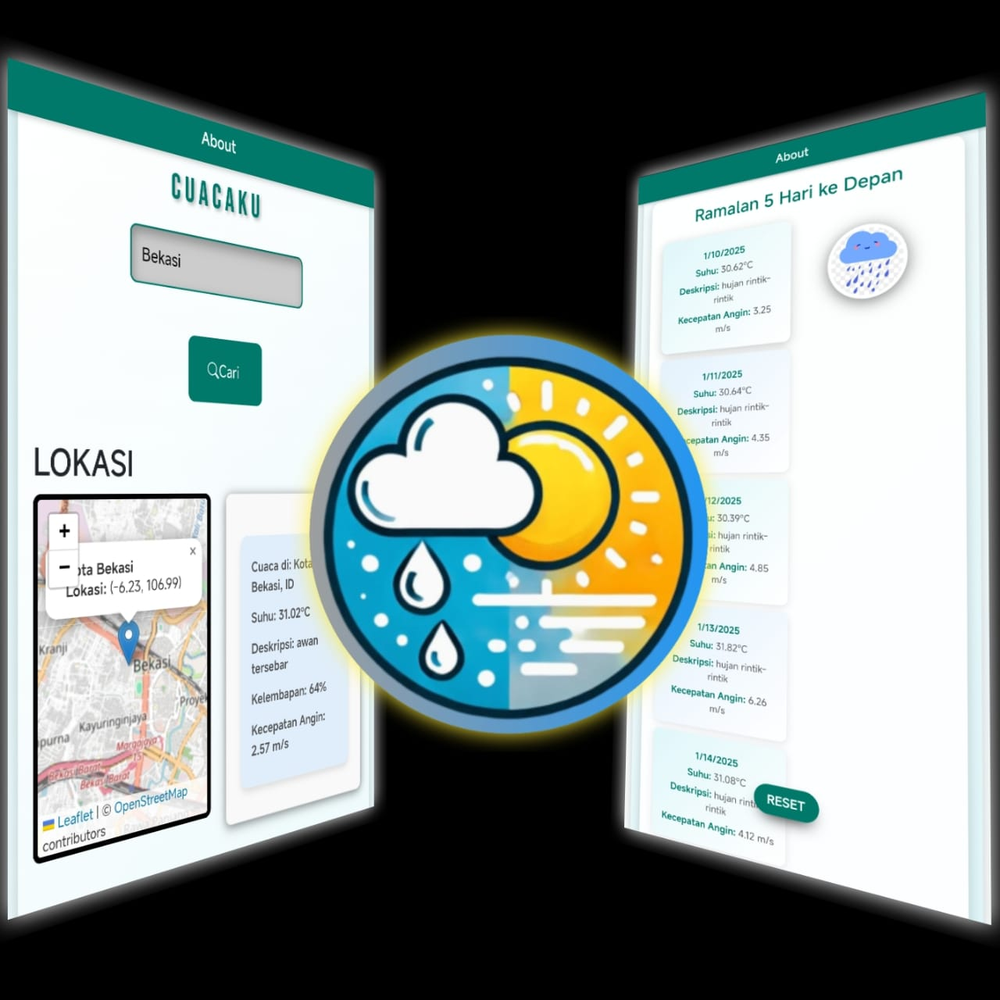

# Cuacaku - Aplikasi Web Cek Cuaca! 🌦️

# PREVIEW



## Apa sih ini? 🤔
Cuacaku adalah web app keren buat ngecek cuaca di lokasi kamu. Simpel, cepet, dan pastinya informatif banget!

test : cuacaku.wuaze.com

## Fitur-fitur Mantap ✨
- Cek cuaca real-time
- Prediksi cuaca per 8 jam
- Perkiraan cuaca 5 hari 
- Support banyak lokasi di Indonesia

## Teknologi yang Dipake 💻
- HTML
- CSS
- JavaScript
- API OpenWeather

## Instalasi Lokal 🛠️
```bash
git clone https://github.com/DimNih/cuacaku
cd cuacaku

